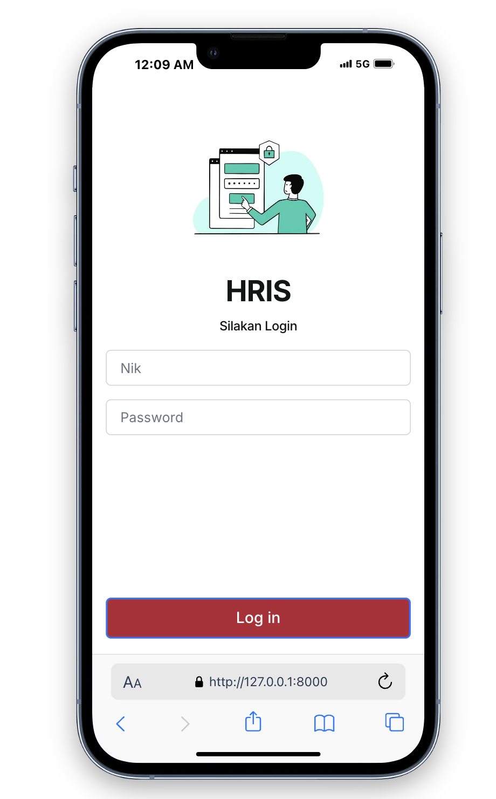
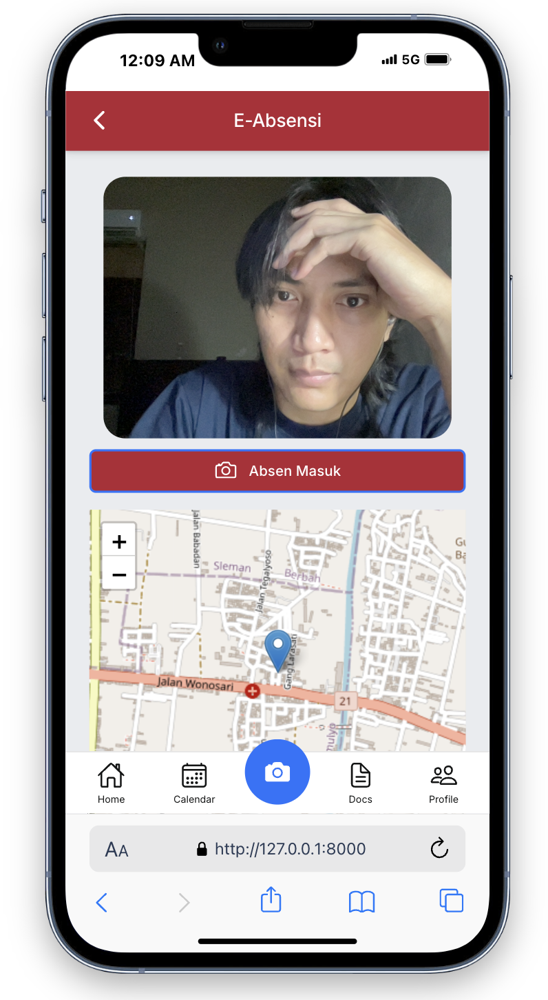
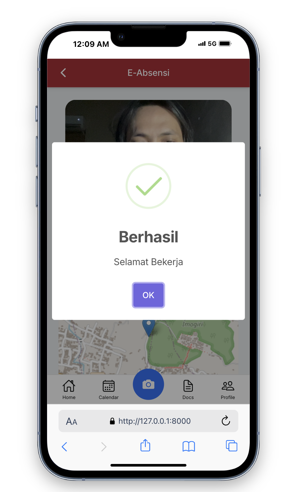
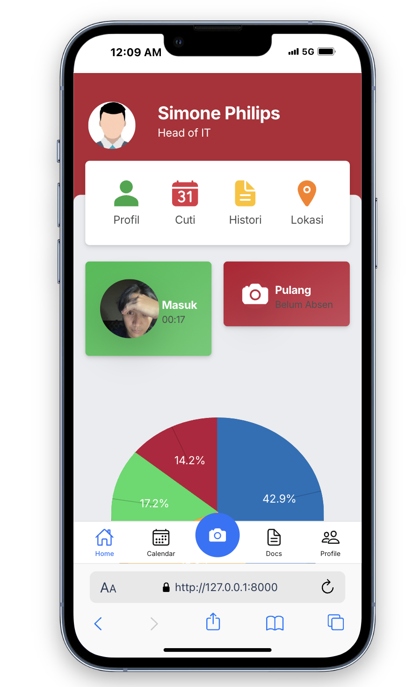
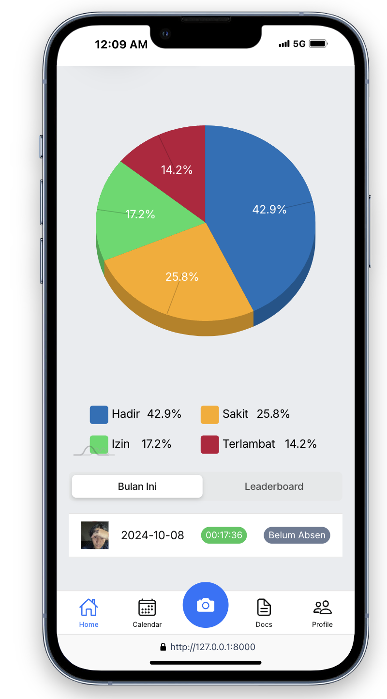
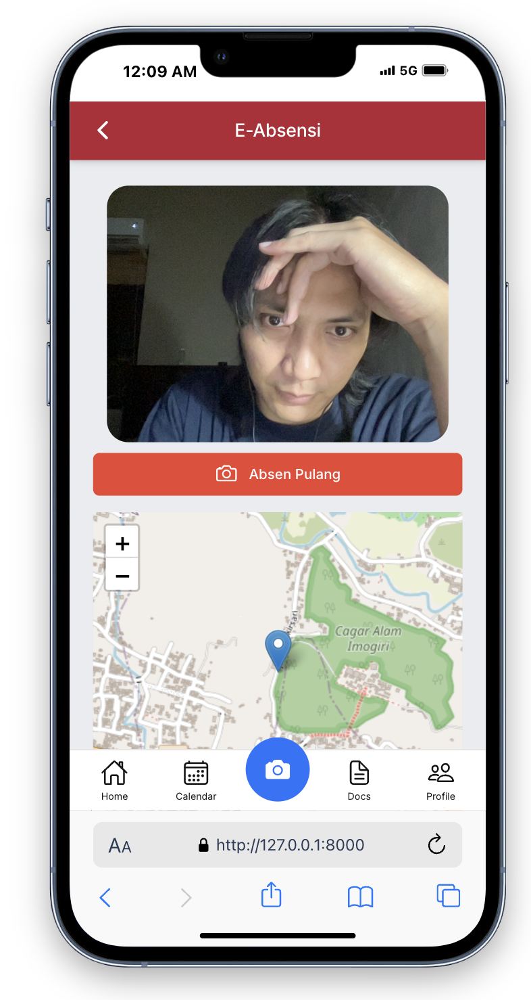
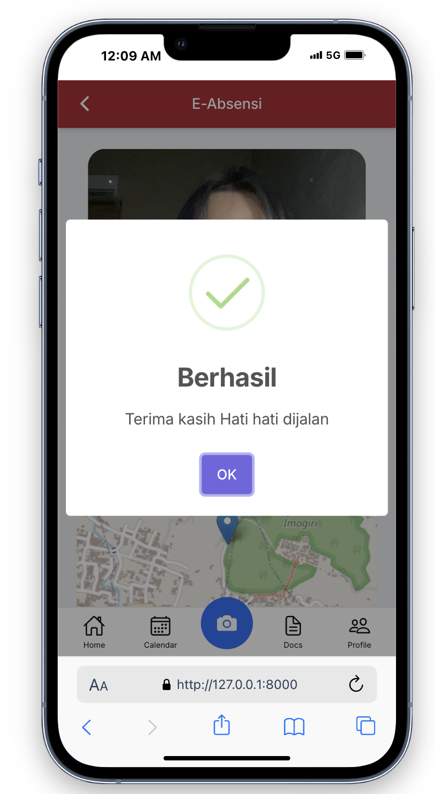

 - Tampilan Login : 

- Tampilan setelah login / menu dashboard : 

- Tampilan Absen dengan koordinasi lokasi gmap

- Tampilan Seteleh absen 

- Tampilan Absen pulang

- Tampilan Setelah Absen Pulang 

